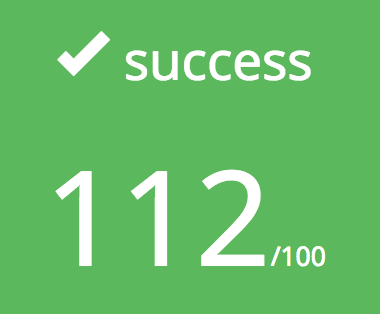

# Ft_Ls

My own implementation of the famous Unix command: ls, using the C programming language. It foments the understanding of the different file types, functions like open, close, read and write.

## Getting Started

### Prerequisites

Clone the repository locally

### Installing

#### Compiling

Run the following commands:

* To compile
	- `make`
* To remove objects:
	- `make clean`
* To remove objects and binary file (program):
	- `make fclean`
* To re-compile:
	- `make re`

### Running the program

It's pretty simple, instead of calling `ls`, call `./ft_ls` from the root directory of the source code after building it.

### Supported flags

	- Long listing display: -l
	- Display recursively: -R
	- Display all files: -a
	- Reverse sort: -r
	- Sort by modification date: -t
	- Display one entry per line: -1
	- Sort by creation date: -U
	- Sort by last access date: -a
	- Show every entry except for current and previous directories: -A
	- Sort by file size: -S

## Deployment

Made for MacOS, might run/compile different in another OS

## Built With

* C language
* Coffee
* Lots of love

## Authors

* **Eugenio Rodriguez** -- [Billano](https://github.com/Billano)

* **Rodolphe Vigneron**

## Acknowledgments

* 42
